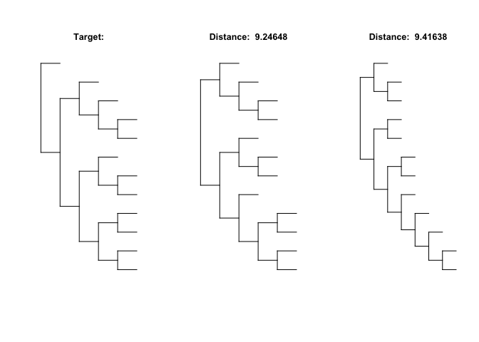

# treenomial

[](https://cran.r-project.org/package=treenomial)

## Overview

The package **treenomial** is an application of polynomials that
uniquely describe trees. It provides tools for tree analysis and
comparison based on polynomials. The core functions are:

  - **`treeToPoly()`**: convert rooted unlabeled binary trees to tree
    distinguishing polynomials described with coefficient matrices

  - **`polyToDistMat()`**: construct a distance matrix from multiple
    coefficient matrices using a distance measure

For the mathematical description of the tree defining polynomial see:

[Liu, Pengyu. “A tree distinguishing polynomial.” arXiv preprint
arXiv:1904.03332 (2019).](https://arxiv.org/abs/1904.03332)

## Installation

To install using [CRAN](https://cran.r-project.org/package=treenomial):

    install.packages("treenomial")

For the development version:

    library(devtools)
    install_github("mattgou1d/treenomial")

## Example tree and polynomial

Consider a three tip tree:

``` r
library(ape)
library(treenomial)

threeTipTree <- rtree(3, rooted = T)
plot.phylo(threeTipTree, use.edge.length = F, show.tip.label = F, direction = "downwards")
```

<!-- -->

It’s polynomial is x^3+xy+y which can equivalently be described with a
coefficient matrix where the element in the ith row, jth column
represents the y^(i-1) \* x^(j-1) coefficient:

``` r
treeToPoly(threeTipTree, varLabels = T)
#>     x^0 x^1 x^2 x^3
#> y^0   0   0   0   1
#> y^1   1   1   0   0
#> y^2   0   0   0   0
```

Using the coefficients of the polynomials, distances between trees can
be compared, below the two closest trees to a random target tree are
found from a random sample:

``` r
# random 12 tip target tree 
target <- rtree(12)

# random sample of 100 trees
sample <- rmtree(100,12)

minInfo <- plotExtremeTrees(target,sample, n = 2, comparison = "min", type = "d")
```

<!-- -->
